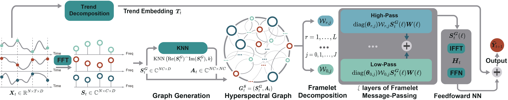

# UFGTime: Reforming the Pure Graph Paradigm for Multivariate Time Series Forecasting in the Frequency Domain :hugs: 

UFGTtime transforms time series into frequency domain signals, preserving sequential information, and introduces a hyperspectral graph structure with sparse topological connections to enhance attention to cross-signal relationships, while mitigating smoothing effects through a global framelet message-passing operator.
<p>
  
  <br />
</p>

## :hammer_and_wrench: Python Dependencies

Our proposed UFGTime framework is implemented in Python 3.10 and major libraries include:

### :warning: Requirement

- <code>Python 3.10</code>
- <code>PyTorch 2.1.1+cu121</code>
- <code>NumPy 1.26.4</code>
- <code>PyG 2.5.3</code>
- <code>DGL 2.0.0.cu121</code>

## 	:weight_lifting: To Train Model:

```bash
python main.py --dataset [dataset]
```

## :open_file_folder: File Specifications

- **data**: Dict of data sources
- **src**: Dict of source code
  - **data_loader**: Description for the dataset classes.
  - **data_provider.py**: Used functions for data dataloader.
  - **model.py**: Description for the model and relative functions.
  - **utils.py**: Description for the help functions.
- **main**: Main code
